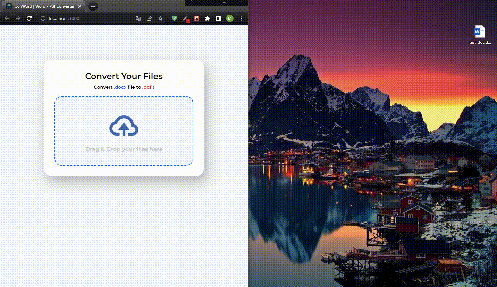

# ConWord - Convert word files to PDF

Easy to use word to pdf converter

## Preview



## Technologies :computer:

- [TypeScript](https://www.typescriptlang.org/)
- [React.js](https://reactjs.org/)
- [React Router](https://reactrouter.com/)

## Installation :ballot_box_with_check:

To run it locally, first you need to clone this project (or download)

```
git clone https://github.com/MustafaYavas/ConWord.git
```

After install, you need to install all dependencies. For that

```
npm install
```

Then, create .env file at the top of the application and add this parameter

```
REACT_APP_BACKEND_URL=http://localhost:5000
```

Finally, run the following command

```
npm start
```

_[Click](https://github.com/MustafaYavas/ConWord-server) to access server side codes_
